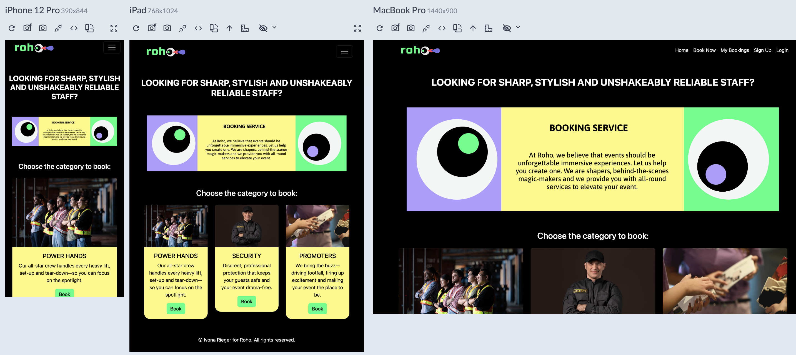
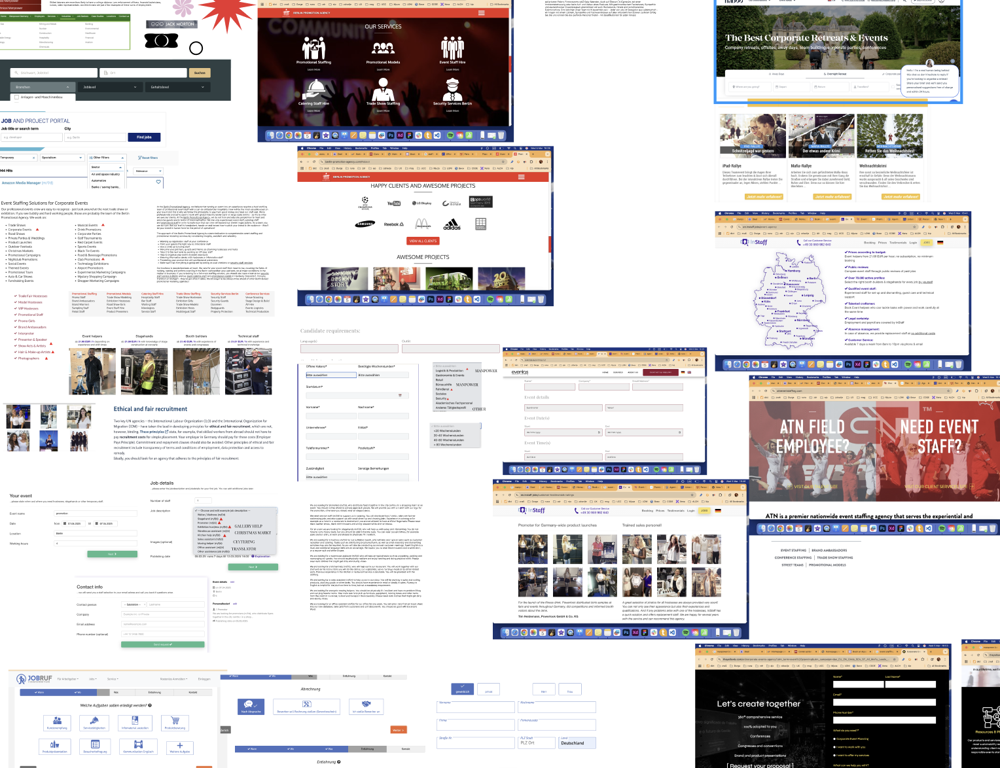
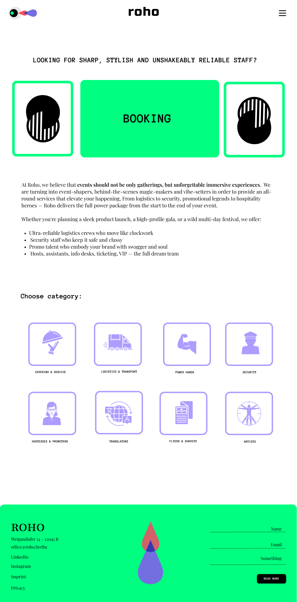
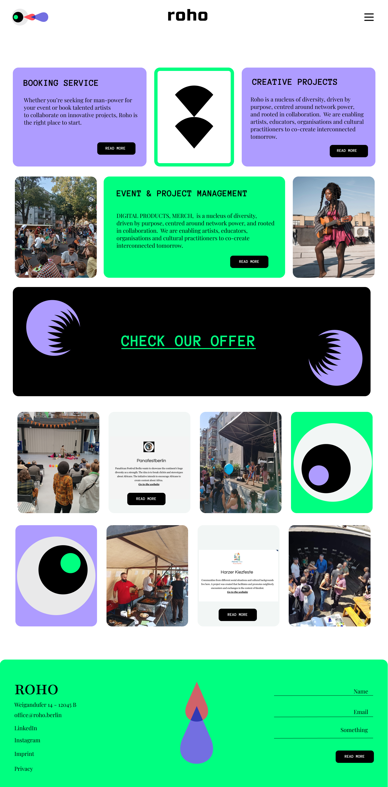
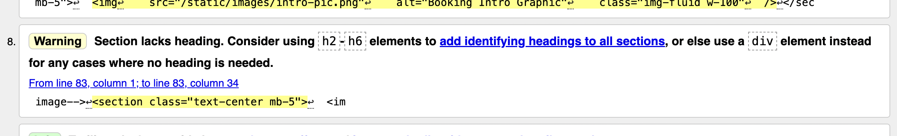
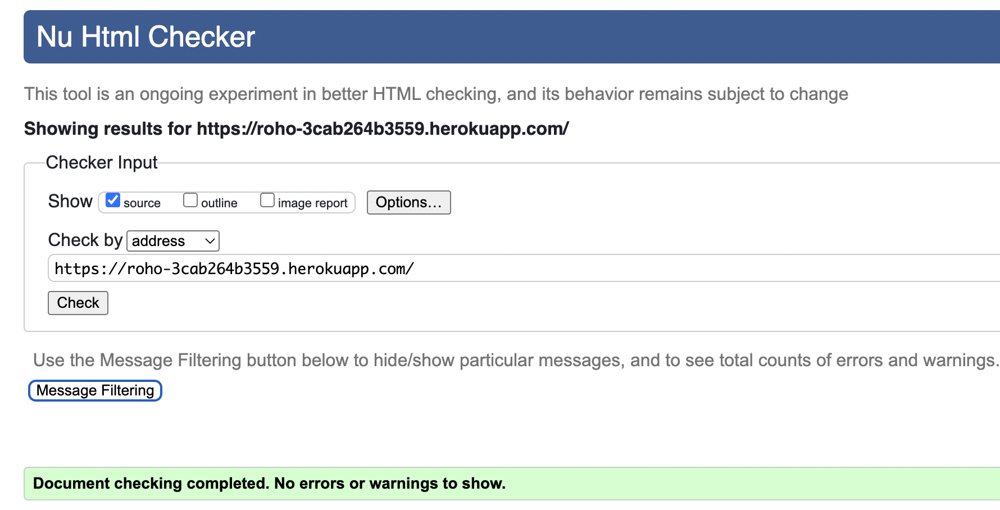
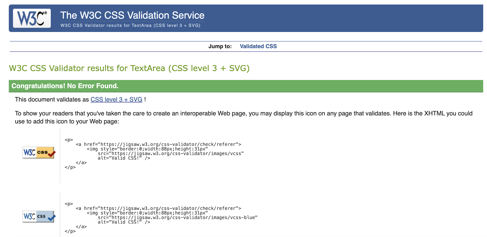
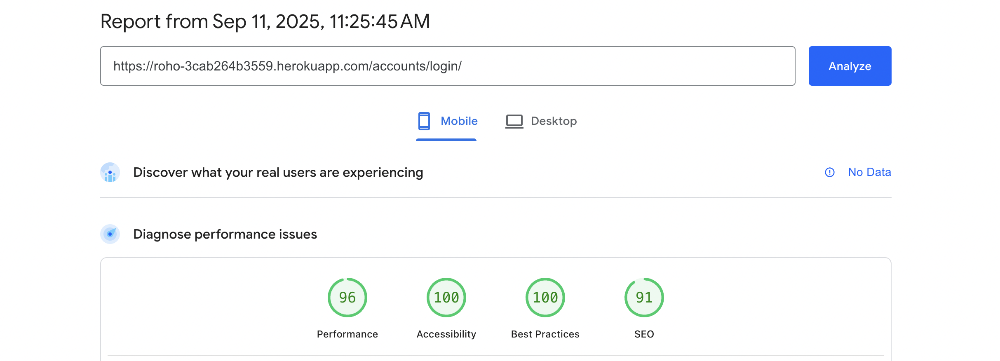
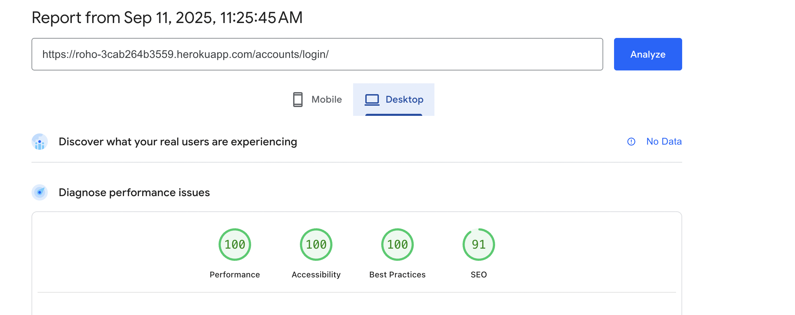

# Roho Booking Service

A sass-free booking system for event agencies, art directors, galleries, fairs — and anyone else who needs to *hire awesome people* without the carrier pigeons, smoke signals, or frantic last-minute phone calls.

## Table of Contents
- [Overview](#overview)
- [UX Design](#ux-design)
- [Agile Methodology](#agile-methodology)
- [Features](#features)
- [User Flows](#user-flows)
- [Pages](#pages)
- [Technologies Used](#technologies-used)
- [Testing](#testing)
- [Deployment](#deployment)
- [Credits](#credits)

## Overview

Roho Booking Service is the secret weapon for event managers and creative agencies who need to book staff — and book them *fast*. Whether you’re curating a gallery opening, orchestrating a fair, or just trying to staff your next big show, Roho’s got your back. Think of it as Tinder for top-notch event staff (minus the awkward swiping).

**Target audience**
- 🏢 Agencies that organize events
- 🎨 Art directors and gallery curators
- 🎉 Fair and festival coordinators
- 💼 Anyone who has ever said, “Why is booking people so complicated?”

## UX Design

### Strategy plane
I originally designed Roho as a full talent marketplace with multi-service booking, profiles, ratings, messaging, and availability calendars. Because of the timeline, I applied Agile scoping and shipped an MVP that solves the essential job end-to-end: discover the service, submit a booking, review/edit/delete it, and let an admin triage entries. The larger concept stays on the roadmap.

### Site goals
- Deliver a fast, low-friction path from landing to confirmed booking
- Keep the interface predictable and consistent on mobile, tablet, and desktop
- Use high contrast and clear hierarchy for easy reading
- Give admins simple oversight to keep data clean
- Leave room for growth without redesigning the core

### Scope and Agile decisions (MVP)
- **Kept:** authentication, Offer → Booking flow, My Bookings with CRUD, basic admin visibility  
- **Deferred:** staff profiles, messaging, calendar availability, quotes, multi-tenant agencies  
- **Process:** small user stories with acceptance criteria, Kanban flow, demoable increments

### User stories

**Admin / business owner**
- As an admin, I want to view all bookings so that I can manage schedules and data integrity.
- As an admin, I want to edit or delete any booking so that I can correct mistakes or remove duplicates.
- As an admin, I want to manage service categories so that I can adjust the offer.

**Visitor / guest**
- As a visitor, I want to understand the service at a glance so that I know if this solves my problem.
- As a visitor, I want clear navigation to Book Now and Register so that I can start immediately.
- As a visitor, I want responsive pages on mobile, tablet, and desktop so that I can use the site anywhere.

**New user**
- As a new user, I want to register an account so that I can submit bookings.
- As a new user, I want helpful form hints and validation so that I can complete registration without confusion.

**Logged-in user**
- As a user, I want to log in and out reliably so that my account stays secure.
- As a user, I want to choose a service from the Offer page and go straight to the correct booking form so that I don’t get lost.
- As a user, I want to submit a booking with event details, dates, and number of people so that the team can staff my event.
- As a user, I want the form to prevent past dates and enforce start before end so that my booking is valid.
- As a user, I want a clear confirmation after submitting so that I know it worked.
- As a user, I want to see my bookings in My Bookings so that I can review them at any time.
- As a user, I want to edit an existing booking with the form pre-filled so that I can fix small mistakes quickly.
- As a user, I want to delete a booking I no longer need so that I don’t clutter the system.

### UX research and market scan
I compared event-staffing and booking platforms to see which fields they request, how fast a user can submit, how availability/pricing is communicated, and where drop-offs happen.

**Sample and method**  
Comparative teardown of agency sites, self-serve tools, and marketplace job boards across DE/EU/US. I captured flows, forms, copy, and interface patterns, then tagged items by friction level, clarity, and mobile behavior.

**Key patterns**
- Many “contact us” flows ask for too many fields before trust is built.
- Mobile usability varies; some forms are cramped and error handling is vague.

**What I adopted**
- One clear path: Offer → Booking form → confirmation
- Minimal required fields with strong hints and inline validation

### Information architecture
- **Navbar:** Home • Book Now • My Bookings • Login/Logout
- **Primary flows:**
  1. Offer → Booking form → confirmation  
  2. My Bookings → Edit/Delete  
  3. Admin at `/admin/` → review and clean up
- **Copy:** short action labels and one clear CTA per section

### Wireframes and design evolution
- Wireframes: a simple path from Home to Book to My Bookings with centered forms and visible CTAs  
  
- Early MVP screens: Offer cards, Booking form, Sign-up/Sign-in, and My Bookings list  
  
- First large landing concept (pre-scope cut): editorial hero blocks, multiple service areas, and a banner callout  
  

I trimmed the large landing to keep speed and clarity for the MVP while keeping the visual language ready for future expansion.

### Visual design and color system
A modern, high-contrast palette so actions are easy to notice and the interface works well for users who need more contrast.

- Pitch black: app background for maximum contrast  
- White: primary text on dark  
- Electric/mint green: primary CTAs, focus rings, active accents  
- Soft violet: secondary accents, icons, card tints  
- Brand accent: highlights and emphasis states  
- Dark greys: elevated panels and form surfaces over black

**Contrast and accessibility**
- Body text on dark meets WCAG 2.2 AA; large CTAs exceed minimums.
- Focus rings are clearly visible on all interactive elements.
- Icons are paired with text or `aria-label` so color alone isn’t the cue.

### Interaction and validation
- Date pickers block past dates and enforce start ≤ end on client and server.
- Required fields validate inline; errors are clear and actionable.
- After submit, the confirmation keeps context and offers a next step.

## Agile Methodology

I worked in a simple Kanban flow (To do → In progress → Done) using GitHub Issues and a GitHub Projects board. I kept stories small with acceptance criteria, grouped related work into epics, and aimed for a fast MVP followed by iteration.

**Process**
- Planned user stories on the board (To do → In progress → Done)
- Wrote acceptance criteria first; adjusted tasks after the first spike
- Shipped in short increments to Heroku with tiny retros (keep/change/try)
- Used MoSCoW to keep scope honest

**Epics**
- Auth and sessions  
- Booking flow (offer cards, form, validation, confirmation)  
- My bookings (list, edit, delete)  
- Admin operations (manage via Django admin, cleanup, light exports)  
- Accessibility and performance (contrast, focus rings, asset sizing)  
- Platform setup and deployment (installation, project setup, Heroku deploy)  
- Foundational UI (home/landing and navigation)

**Example user story**
- As a user I can select a booking service, fill the form, and send my inquiry so that I can receive the service I need.  
  - Criterion 1: the booking offer is visible and reachable  
  - Criterion 2: the form validates and submits correctly  
  - Criterion 3: after submit, the booking appears in My Bookings

**Prioritization (MoSCoW)**
- **Must have:** authentication, Offer → Booking flow, My Bookings CRUD, admin visibility  
- **Should have:** category management in admin, clearer field hints, high-contrast theme and keyboard navigation  
- **Could have:** quick quotes, saved organizations, better exports, richer empty states  
- **Won’t have (this release):** messaging, staff profiles/ratings, availability calendars, multi-tenant features

I track work on a GitHub Projects Kanban here:  
[roho_project – Kanban board](https://github.com/users/Ivrigy/projects/3/views/1)

## Features

### 🔐 Authentication
- User sign-up / log-in / log-out
- Passwords stored securely using Django auth

### 📝 Booking Service
- Low-friction booking form
- Pick dates, times, and number of staff
- A submit flow that actually works

### 🔄 CRUD Operations
- Create bookings
- Read your upcoming “staff deployments”
- Update details quickly
- Delete when plans change

### 🎛️ Admin Dashboard
- Superusers can view and manage all bookings
- Remove duplicates and keep data clean

## User Flows

1. **User A – Newbie**  
   Visits homepage → registers → logs in → clicks a Book card → completes the booking → edits/deletes later in **My Bookings** → logs out
2. **User B – Return visitor**  
   Logs in → lands on **My Bookings** → edits or deletes an existing booking → logs out
3. **Admin**  
   Logs in to `/admin/` → surveys all bookings → cleans up entries

## Pages

### 1) Intro / Homepage

- Bold header asks, “LOOKING FOR SHARP, STYLISH, AND UNSHAKABLY RELIABLE STAFF?”
- Quick links: **Home** | **Book Now** | **My Bookings** | **Logout** (once logged in)
- You see the pitch and the paths; no endless scrolling required.

### 2) Service Categories (“Offer”)

- Shortcut: click **Book Now** to land here instantly
- Cards: **POWER HANDS** (💪), **SECURITY** (🛡), **PROMOTERS** (📣)
- Each card has a **Book** button that jumps to the form

### 3) Login

- Username + Password
- Hit Enter and you’re in (or use your password manager)

### 4) Sign Up

- Username, Password, Password confirmation  
- Hints below each field; no surprises after submit

### 5) Book a Service (Form)

- From **Offer → Book** or Navbar → **Book Now**
- Fields: Name, Email, Company, Event Name, Service Type, People, Hours, Budget, Start/End dates, Notes
- Validation: no past dates, People ≥ 1, required fields enforced

### 6) My Bookings

- Dark-mode list of your gigs: title, service, dates, notes
- **Edit** and **Delete** with one click

### 7) Edit Booking
Same form as Book a Service with pre-filled values.

### 8) Admin Panel
At `/admin/` — full CRUD on bookings.

## Technologies Used

**Languages**
- HTML5
- CSS3
- JavaScript (ES6)
- Python 3.12

**Frameworks & libraries**
- Django 5.2 (templates, auth, forms, admin)
- Bootstrap 5
- Gunicorn (WSGI server)
- WhiteNoise (static files)
- psycopg2-binary (PostgreSQL adapter)

**Database**
- PostgreSQL (production)
- SQLite (local development)

**Hosting & deployment**
- Heroku (hosting, config vars, logs)
- Heroku CLI for deploys

**Version control & PM**
- Git and GitHub
- GitHub Projects Kanban for stories and epics  
  Kanban: https://github.com/users/Ivrigy/projects/3/views/1

**Quality & testing**
- flake8 (Python linting)
- JSHint (JavaScript linting)
- W3C Markup Validator & W3C CSS Validator
- Lighthouse and axe DevTools

**Developer tools**
- VS Code
- Chrome DevTools
- Responsively App
- Environment variables via `.env` locally and Heroku config vars

**Design & assets**
- Figma (wireframes and UI)
- Google Fonts
- Image optimization (e.g., TinyPNG) as needed

## Testing

I approached testing in layers: validators and linters → manual functional tests (happy path + edge cases) → accessibility checks → performance audits → cross-browser/device sanity checks. I recorded defects and fixes, and I kept the validators clean on the deployed build.

### Test environments

- **Local**: macOS, Python 3.12, Django 5.2, Chrome 139, Safari 17  
- **Staging/Prod**: Heroku (Gunicorn + WhiteNoise, PostgreSQL)  
- **Branching**: feature branches → PRs after lint/validators pass

---

### 1) Static analysis & validators

**Python (PEP 8)**
- Tools: `flake8` + VS Code linter  
- Checks: max line length, naming, whitespace/indentation, unused imports/vars  

**JavaScript (ES6+)**
- Tool: **JSHint** (`esversion: 6`)  
- Checks: undefined vars, missing semicolons where required, control flow

**HTML & CSS**
- **W3C Nu HTML Checker**: fixed all errors and actionable warnings
  - Added `<!DOCTYPE html>` and `<html lang="en">` in `base.html`
  - Ensured a single `<title>` in `<head>`
  - Replaced decorative `<section>` with `
` or added visually hidden `<h2>` to satisfy “section needs heading”
  - Removed trailing slashes on void elements (``, `<meta>`, `<link>`)
  - Fixed Django template output that the validator saw as raw `` by validating the deployed pages, not raw templates
  - Corrected `<time datetime="...">` to valid ISO dates where used or replaced with plain text
  - Removed inline `aria-describedby="id_*_help"` strings that accidentally rendered as text
  - Ensured all anchor `href` values are real URLs on the rendered page, not template tags
  - Example warnings addressed:  
      
    

- **W3C CSS Validator**: zero errors after cleanup  
  

---

### 2) Functional manual testing

I tested each feature on local and on the deployed Heroku app. Below are the core scenarios with pass criteria.

**Authentication**
- Register → success message, auto-login (where configured) or redirect to Login → Login → Logout → sessions expire correctly
- Nav changes with auth state (Login/Logout/My Bookings visibility)

**Booking flow**
- Offer → Book form preselects/keeps context
- **Validation rules**
  - Required fields enforced with clear inline errors
  - `start_date` cannot be in the past (HTML `min` + server validation)
  - `end_date` must be same day or after `start_date`
  - People ≥ 1; Hours ≥ 1; Budget accepts numbers only
- Successful submit shows confirmation and the booking appears in **My Bookings**

**My Bookings**
- Only the signed-in user’s bookings are shown
- **Edit** opens the same form with prefilled data; validation still enforced
- **Delete** shows a confirm screen and removes only the selected booking

**Admin**
- `/admin/` lists bookings; staff can search, edit, and delete
- Category/offer list manageable via Django admin

**Negative/edge cases**
- Direct access to protected URLs when logged out → redirected to Login
- Tampering with IDs in edit/delete URLs → 404/permission denied for other users’ objects
- Submitting with JS disabled → server-side validation still blocks bad input
- Large notes field; overly long company names/emails → form errors as expected

**Test matrix (selected)**

| Area        | Scenario           | Steps                                  | Expected                                       | Result |
|-------------|--------------------|----------------------------------------|-----------------------------------------------|--------|
| Accounts    | Register           | Fill valid form → Submit                | User created, redirect/msg                    | ✅     |
| Accounts    | Login              | Enter valid creds                       | Redirect to prior/landing                     | ✅     |
| Bookings    | Create             | Fill all fields                         | Booking saved, visible in My Bookings         | ✅     |
| Bookings    | Past date          | `start_date` = yesterday                | Error “Cannot book past dates.”               | ✅     |
| Bookings    | Order rule         | `end_date` < `start_date`               | Error “End date must be on or after …”        | ✅     |
| Bookings    | Edit               | Change notes/dates                      | Updates persist                               | ✅     |
| My Bookings | Ownership          | User A tries to view User B’s booking   | Not visible / blocked                         | ✅     |
| Validation  | HTML (Nu)          | Validate deployed pages                 | 0 errors, warnings addressed                  | ✅     |
| Validation  | CSS (Jigsaw)       | Validate stylesheet                     | 0 errors                                      | ✅     |

---

### 3) Accessibility

**Keyboard**
- All controls reachable in logical order; visible focus outlines (Bootstrap + custom high-contrast focus ring)
- Skip repetitive nav by predictable structure; no keyboard traps

**Semantics**
- One `<h1>` per page; meaningful `<h2>` structure (visually hidden where needed)
- Form labels bound via `for`/`id` pairs; helpful error text appears next to fields

**Color/contrast**
- Text and interactive elements meet **WCAG 2.2 AA** on dark background

**Automated checks**
- **Lighthouse** (A11y category) and **axe DevTools**: no critical issues

---

### 4) Performance (Lighthouse)

- Audited Home, Offer, Book form, and My Bookings on **Mobile** and **Desktop** in Chrome DevTools (Navigation mode; Performance, A11y, Best Practices, SEO)

| Device   | Perf | A11y | Best | SEO |
|----------|------|------|------|-----|
| Mobile   | 96   | 100  | 100  | 91  |
| Desktop  | 100  | 100  | 100  | 91  |

  

**Perf notes**
- Static assets served via WhiteNoise; images sized and compressed
- Avoided blocking scripts; Bootstrap from CDN with SRI

---

### 5) Browser/device checks

- **Desktop**: Chrome 139, Safari 17 — layout and forms work as expected
- **Mobile**: iOS Safari (via device + Responsively App) — form controls usable; no horizontal scroll; safe tap targets

---
**Warnings fixed**

- “Section lacks heading” → added meaningful `<h2>` or replaced decorative `<section>` with `
`  
- “Trailing slash on void elements” → removed self-closing slashes on ``, `<meta>`, `<link>`  
- Ensured `<!DOCTYPE html>`, `<html lang="en">`, and a single `<title>` in `base.html`  
- Validated that anchors render real URLs (not raw ``) and that template tags resolve in production

---

### Bugs & Fixes

1) **Date picker: duplicate icon & invalid ranges**  
   **Symptoms:** Two calendar icons on `type="date"` inputs; past dates selectable; `end_date` could be before `start_date`.  
   **Cause:** Legacy CSS background image overlapping the native control + missing constraints.  
   **Fix:** Removed background, set HTML `min` on both date fields, enforced rules server-side.

---

### 6) Defect log (examples)

1. **Date inputs showed two calendar icons**  
   **Cause**: legacy CSS background over native `type="date"`  
   **Fix**: removed background image; kept native picker; enforced `min` on both fields

2. **Nu HTML errors on templates**  
   **Cause**: validating raw templates showed `` / `` as literal text  
   **Fix**: validated the rendered Heroku pages; ensured `base.html` had `<!DOCTYPE html>`, `<html lang>`, single `<title>`, and proper headings

3. **Validator warning “section lacks heading”**  
   **Fix**: added semantic `<h2>` (visually hidden where purely decorative) or used `
`

---

### 7) What’s next

- Add automated **Django `TestCase`** coverage for bookings CRUD and permissions
- Add **Playwright** smoke tests for the core flows
- Track Lighthouse scores in CI on main after deploy
## Deployment

Deployed early to Heroku to surface integration issues (static files, DB, settings) ASAP.

- Django 5.2
- SQLite for local; PostgreSQL in production (Heroku Postgres or external)
- Example app name below: `roho-3cab264b3559` (replace with yours)

Steps before first deploy

**Create the Heroku app**  
Heroku → New → Create new app → name + region → Create app

**Add PostgreSQL**  
Resources → Add-ons → Heroku Postgres (Hobby Dev – Free)  
—or— supply an external `DATABASE_URL`

**Local env**  
Create `env.py`; add to `.gitignore`

**Settings**  
Make settings env-aware; configure DB and static files; run initial migrations locally

**Procfile**  
At repo root (same level as `manage.py`):  
`web: gunicorn roho.wsgi`

**Requirements**  
Django==5.2.*
gunicorn
whitenoise
dj-database-url
psycopg2-binary

Commit and push to GitHub.

Commit and push.

First deployment

**Config Vars (Heroku → Settings)**  
- `SECRET_KEY` → your secret  
- `DEBUG` → `False`  
- `DATABASE_URL` → only if using external Postgres

(Optional for early builds) `DISABLE_COLLECTSTATIC=1` — remove before final.

**Deploy tab**  
Deployment method: GitHub → connect repo → select branch → Deploy Branch.  
Open app to verify.

Final deployment

**Production settings**  
- `DEBUG = False`  
- `ALLOWED_HOSTS = ["your-app.herokuapp.com", "localhost"]`  
- `CSRF_TRUSTED_ORIGINS = ["https://your-app.herokuapp.com"]`

**Heroku Config Vars**  
- Remove `DISABLE_COLLECTSTATIC` if set  
- Ensure `DATABASE_URL` and `SECRET_KEY` exist

Push latest to GitHub → Deploy Branch in Heroku → successful build runs `collectstatic` via WhiteNoise → Open app.

**Notes & gotchas**
- **CSRF/Host:** Bad Request? Recheck `ALLOWED_HOSTS` and `CSRF_TRUSTED_ORIGINS`.
- **Static files:** Use `` and paths like ``.
- **Migrations:**  
python3 manage.py makemigrations
python3 manage.py migrate
- **Admin user:**  
python3 manage.py createsuperuser

- **Gunicorn:** `Procfile` must be exactly `web: gunicorn roho.wsgi`.

### Forking the repository

How to fork

Open the repo on GitHub → click **Fork** (top-right).  
You’ll get your own copy to experiment without affecting the original.

## Credits

https://github.com/bitlabstudio/django-booking  
https://github.com/DeanA1985/Restaurant-Booking-System?tab=readme-ov-file  
https://getbootstrap.com/  
https://code.visualstudio.com/  
https://www.youtube.com/watch?v=opjyyXoqrxg  
https://www.djangoproject.com/  
https://developer.mozilla.org/en-US/docs/Learn_web_development/Getting_started  

And RORY for having patience with an ADHD person.