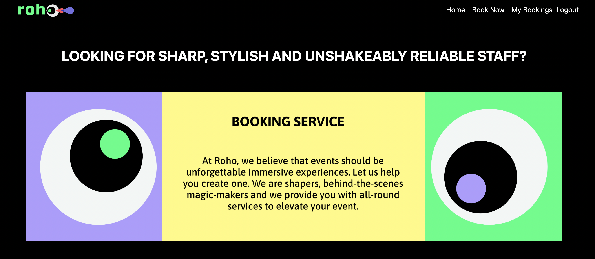
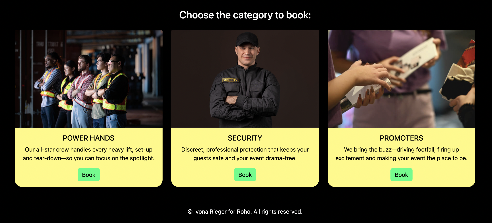
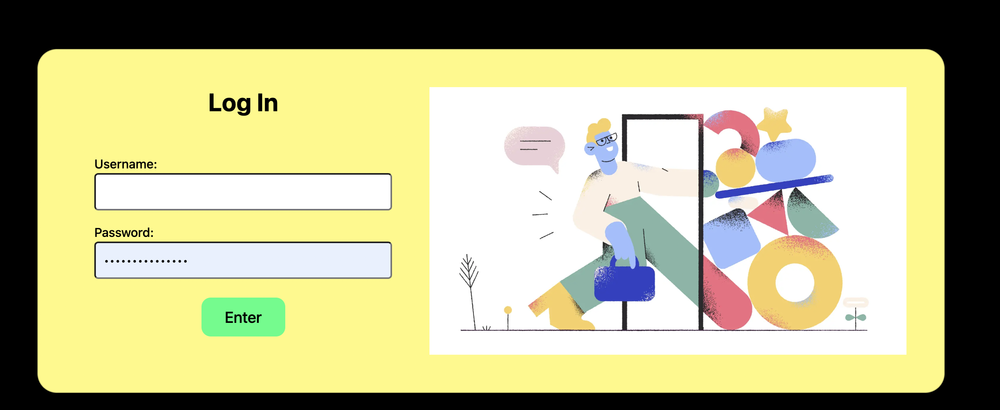
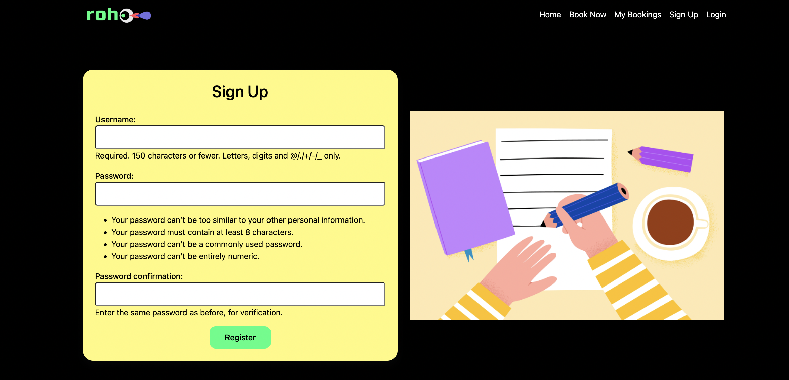
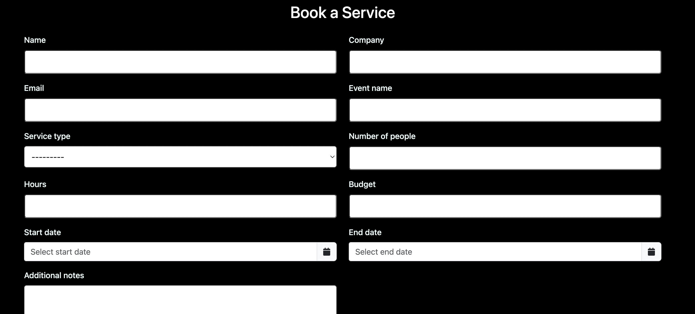
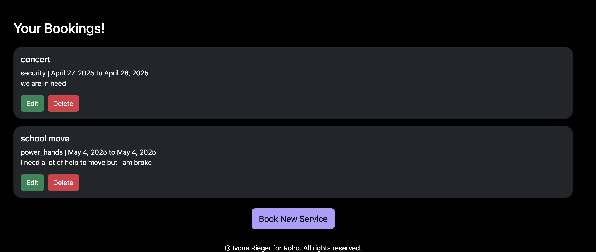
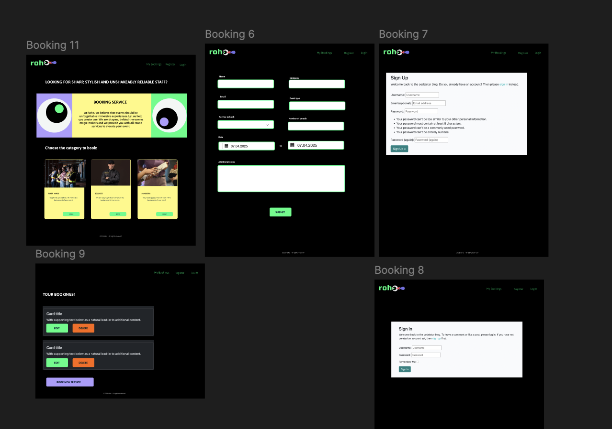
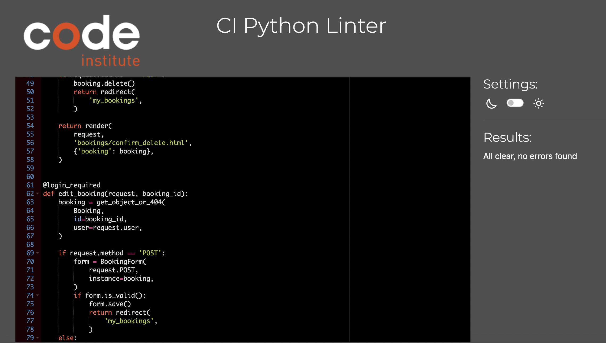
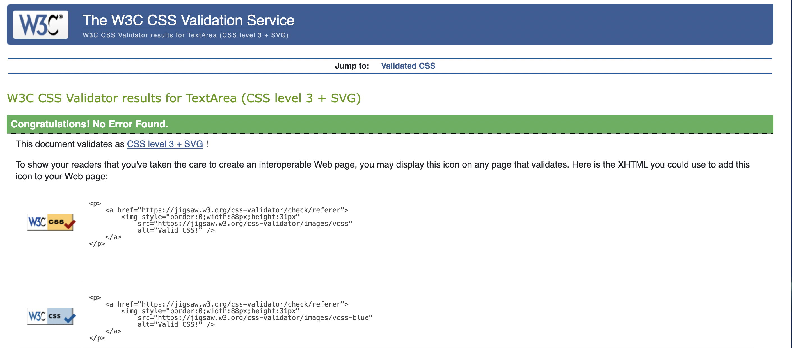

# Roho Booking Service

A no-nonsense, sass-free booking system for event agencies, art directors, galleries, fairs—and anyone else who needs to *hire awesome people* without the carrier pigeons, smoke signals, or frantic last-minute phone calls.

## Table of Contents
- [Overview](#overview)  
- [Features](#features)  
- [Technologies Used](#technologies-used)  
- [User Flows](#user-flows)  
- [Pages](#pages)  

## Overview

Roho Booking Service is the secret weapon for event managers and creative agencies who need to book staff—and book them *fast*. Whether you’re curating a gallery opening, orchestrating a fair, or just trying to fill seats at your next big show, Roho’s got your back. Think of it as Tinder for top-notch event staff (minus the awkward swiping).

**Target Audience:**  

- 🏢 Agencies that organize events  
- 🎨 Art directors and gallery curators  
- 🎉 Fair and festival coordinators  
- ‍💼 Anyone who ever said “Why is booking people so complicated?”  

## Features

### 🔐 Authentication  
- **User sign-up / log-in / log-out**  
- Passwords safely tucked away behind Django’s fortress walls  

### 📝 Booking Service  
- Fill out a slick, no-drama booking form  
- Pick dates, times, and number of staff needed  
- “Submit” button that actually works (we promise)  

### 🔄 CRUD Operations  
- **Create** new bookings (duh)  
- **Read** your upcoming “glorious staff deployments”  
- **Update** mind-blowing changes on the fly  
- **Delete** — because sometimes plans change (or budget cuts happen)  

### 🎛️ Admin Dashboard  
- Superusers can view and manage **all** bookings  
- Cull duplicates, banish inappropriate entries, or just admire your own organizational prowess  

## Technologies Used
- **Python 3.12** & **Django 5.1.6** 
- **HTML5, CSS3, JavaScript** 
- **Gunicorn** & **WhiteNoise**
- **PostgreSQL** 
- **Heroku** –
- **GitHub**

## User Flows

1. **User A – Newbie**  
   - Visits Homepage → Registers (quick as a flash) → Logs in  
   - Clicks “Book” card → Fills in the booking request → 🎉 Confirmed!  
   - Edits or deletes bookings on “My Bookings” page → Logs out  

2. **User B – The Return Visitor**  
   - Logs in → Lands on “My Bookings” (because we love you)  
   - Edits or deletes an existing booking → Logs out  

3. **Admin User – The Overlord**  
   - Logs into `/admin/` → Surveys all bookings at a glance  
   - Deletes duplicates, flags shady requests, or just sips coffee while watching it all  

## Pages
### 1. Intro / Homepage  

- **Where you land:** Bold header asks “LOOKING FOR SHARP, STYLISH AND UNSHAKEABLY RELIABLE STAFF?”  
- **Quick links:**  
  - **Home** | **Book Now** | **My Bookings** | **Logout** (once you’re in)  
- **Why it rocks:** You see the pitch, you see the logo, you know exactly where to click. No scroll safari required.

### 2. Service Categories (“Offer” Page)  
 
- **URL / Shortcut:** Click **Book Now** → land here instantly.  
- **Cards on display:**  
  - **POWER HANDS** (💪 heavy lifting heroes)  
  - **SECURITY** (🛡 keep the drama off your premises)  
  - **PROMOTERS** (📣 hype machines on demand)  
- **CTA:** Each card has its own **Book** button—click one and BOOM, you’re off to the form.

### 3. Login Page  
 
- **URL / Shortcut:** Navbar → **Login**  
- **Fields:** Username, Password  
- **Magic moment:** Hit **Enter** (that glowing green button) and you’re in.  
- **Pro tip:** If you forget your creds, you *may* have to create a new account... or consult your password manager.

### 4. Sign Up Page  
 
- **URL / Shortcut:** Navbar → **Register**  
- **Fields:**  
  - Username (150-char limit, no emojis—sorry)  
  - Password + Confirmation (must be >8 chars, not “12345678”)  
- **UX treat:** Real-time hints below each field keep you honest. No post-submit surprises!

### 5. Book a Service (Booking Form)  

- **URL / Shortcut:**  
  - From **Offer** card “Book” → direct jump  
  - Or Navbar → **Book Now**  
- **Form bits:**  
  - Name, Email, Company, Event Name  
  - Service Type dropdown (what you chose on Offer)  
  - Number of People, Hours, Budget  
  - Start Date / End Date (date-picker prevents past dates)  
  - Additional Notes (“We need coffee ASAP!”)  
- **Validation shortcuts:**  
  - 🔒 Start / End date locked to future  
  - 🔢 “Number of People” ≥ 1  
  - ✏️ All required fields enforced

  ### 6. My Bookings  
  
- **URL / Shortcut:** Navbar → **My Bookings**  
- **What you see:** A dark-mode list of your gigs—each card shows:  
  - Event title & service type  
  - Dates & notes  
  - **Edit** (green) and **Delete** (red) buttons  
- **One-click fixes:**  
  - **Edit** reloads the form prefilled  
  - **Delete** vanishes unwanted bookings faster than your inbox spam

  ### 7. Edit Booking  
*(Same form as “Book a Service,” but with your old info pre-popped in. No extra screenshots needed—just you, channeling your inner event-planner zen.)*

### 8. Admin Panel  
*(Not shown here, but imagine the ultimate CRUD dashboard at `/admin/` where you can view, edit, or obliterate any booking. Capes optional.)*

## Wireframes
 

## Testing
Testing was woven into every step of Roho’s development—because “it works on my machine” isn’t a QA strategy. While we didn’t write Django `TestCase` unit tests (yet), **manual testing drove the project to rock-solid reliability**.

### Manual Testing Overview

- **Authentication Workflow**  
  - Registration, login, logout, and session persistence  
  - Navbar links updating correctly for logged‐in vs. guest users  
- **Booking System**  
  - Create, read, update, and delete bookings  
  - Date‐picker validation (no time machines allowed—past dates are blocked)  
- **Form & UX Validation**  
  - JavaScript checks for required fields, valid staff counts, and future dates  
  - Backend re-validation in Django to catch anything that slipped past the client  
- **Navigation & Layout**  
  - Consistent header/footer across all pages  
  - Responsive behavior on desktop, tablet, and (lightning‐fast) mobile

  ### 🐍 Python (PEP8)

  - **Linting:** Used **flake8** and VS Code’s built-in linter to enforce style.  
- **Checks performed:**  
  - Maximum line length  
  - Proper function/class names (snake_case & CamelCase)  
  - Consistent indentation and whitespace  
  - Removal of unused imports and variables  

### 📜 JavaScript (ES6+

- **Validation:** Ran **JSHint** (configured with `esversion: 6`) on all custom scripts.  
- **Checks performed:**  
  - No undefined variables  
  - Required semicolons (where needed)  
  - Logical flow and syntax correctness  

### 🌐 HTML5 & CSS3

- **HTML:** Passed through the **W3C Markup Validator**—only minor warnings about self-closing tags.  
- **CSS:** Verified with the **W3C CSS Validator**—zero errors, responsive media queries all clear.  
- **Responsive rules:** Ensured flexible layouts using CSS Grid and Flexbox across desktop, tablet, and mobile.

## Kanban Board

- **Why it matters:**  
  - Keeps the team aligned on what’s next  
  - Highlights bottlenecks (“Why is nothing in Review?!”)  
  - Turns project madness into a satisfying card shuffle
Not really sattisfied with it.

## Credits

https://github.com/bitlabstudio/django-booking

https://github.com/DeanA1985/Restaurant-Booking-System?tab=readme-ov-file

https://getbootstrap.com/

https://code.visualstudio.com/

https://www.youtube.com/watch?v=opjyyXoqrxg

https://www.djangoproject.com/

https://developer.mozilla.org/en-US/docs/Learn_web_development/Getting_started

And RORY for having patience with ADHD person

